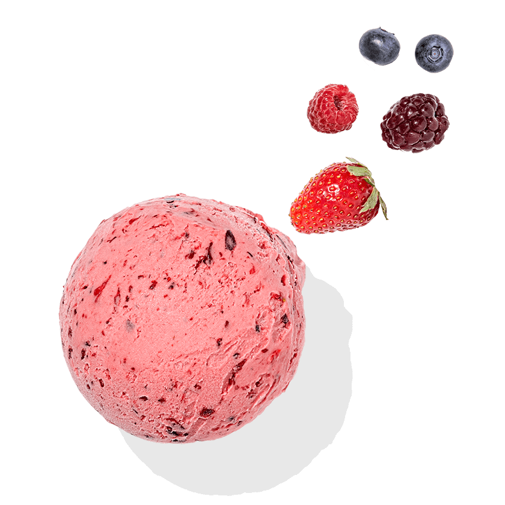

                    {/* 

                        

                            
                        

                        

                            <h5>Winter Jacket</h5>
                            <h6>$99.99</h6>
                            <button className="product-add"> Add to Cart</button>
                        

                    

                    

                        

                            
                        

                        

                            <h5>Winter Jacket</h5>
                            <h6>$99.99</h6>
                            <button className="product-add"> Add to Cart</button>
                        

                    

                    

                        

                            
                        

                        

                            <h5>Winter Jacket</h5>
                            <h6>$99.99</h6>
                            <button className="product-add"> Add to Cart</button>
                        

                    

                    

                        

                            
                        

                        

                            <h5>Winter Jacket</h5>
                            <h6>$99.99</h6>
                            <button className="product-add"> Add to Cart</button>
                        

                    

                    

                        

                            
                        

                        

                            <h5>Winter Jacket</h5>
                            <h6>$99.99</h6>
                            <button className="product-add"> Add to Cart</button>
                        

                    

                    

                        

                            
                        

                        

                            <h5>Winter Jacket</h5>
                            <h6>$99.99</h6>
                            <button className="product-add"> Add to Cart</button>
                        

                    

                    

                        

                            
                        

                        

                            <h5>Winter Jacket</h5>
                            <h6>$99.99</h6>
                            <button className="product-add"> Add to Cart</button>
                        

                    

                    

                        

                            
                        

                        

                            <h5>Winter Jacket</h5>
                            <h6>$99.99</h6>
                            <button className="product-add"> Add to Cart</button>
                        

                    

                    

                        

                            
                        

                        

                            <h5>Winter Jacket</h5>
                            <h6>$99.99</h6>
                            <button className="product-add"> Add to Cart</button>
                        

                    

                    

                        

                            
                        

                        

                            <h5>Winter Jacket</h5>
                            <h6>$99.99</h6>
                            <button className="product-add"> Add to Cart</button>
                        

                    

                    

                        

                            
                        

                        

                            <h5>Winter Jacket</h5>
                            <h6>$99.99</h6>
                            <button className="product-add"> Add to Cart</button>
                        

                    

                    

                        

                            
                        

                        

                            <h5>Winter Jacket</h5>
                            <h6>$99.99</h6>
                            <button className="product-add"> Add to Cart</button>
                        

                    

                    

                        

                            
                        

                        

                            <h5>Winter Jacket</h5>
                            <h6>$99.99</h6>
                            <button className="product-add"> Add to Cart</button>
                        

                    

                    

                        

                            
                        

                        

                            <h5>Winter Jacket</h5>
                            <h6>$99.99</h6>
                            <button className="product-add"> Add to Cart</button>
                        

                    

                    

                        

                            
                        

                        

                            <h5>Winter Jacket</h5>
                            <h6>$99.99</h6>
                            <button className="product-add"> Add to Cart</button>
                        

                    

                    

                        

                            
                        

                        

                            <h5>Winter Jacket</h5>
                            <h6>$99.99</h6>
                            <button className="product-add"> Add to Cart</button>
                        

                    

                    

                        

                            
                        

                        

                            <h5>Winter Jacket</h5>
                            <h6>$99.99</h6>
                            <button className="product-add"> Add to Cart</button>
                        

                    

                    

                        

                            
                        

                        

                            <h5>Winter Jacket</h5>
                            <h6>$99.99</h6>
                            <button className="product-add"> Add to Cart</button>
                        

                    

                    

                    

                        

                            
                        

                        

                            <h5>Winter Jacket</h5>
                            <h6>$99.99</h6>
                            <button className="product-add"> Add to Cart</button>
                        

                    
 */}
